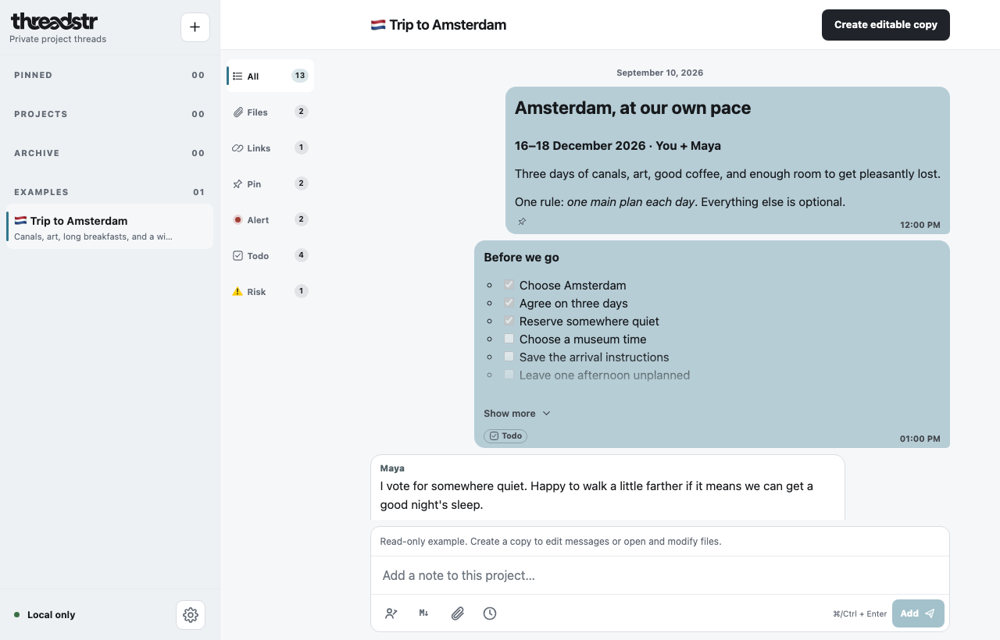
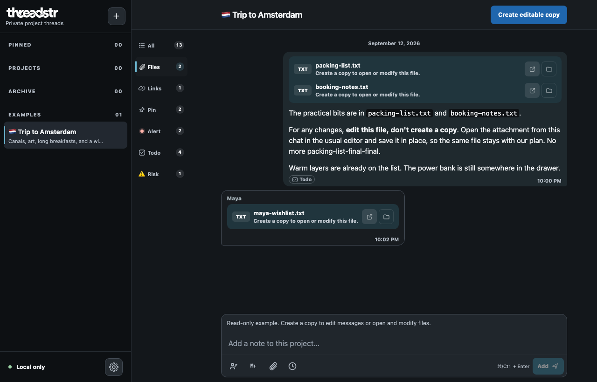
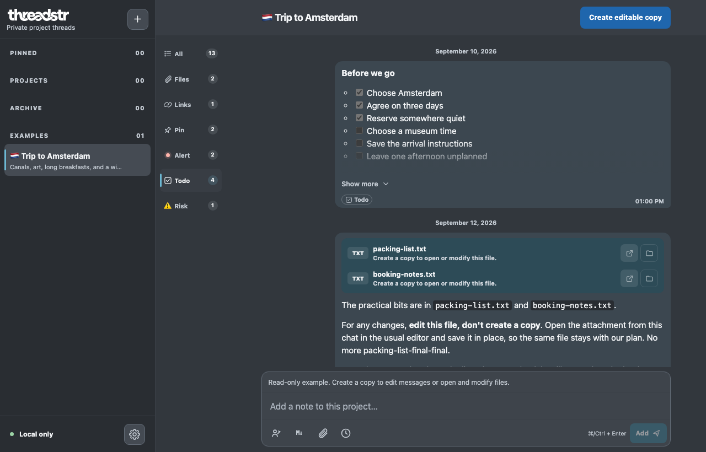

<h1>
  <picture>
    <source media="(prefers-color-scheme: dark)" srcset="branding/threadstr/v1/wordmark/threadstr-wordmark-on-dark.svg">
    
  </picture>
</h1>

**Your projects, remembered like a chat — private on your own computer.**

threadstr is an open-source personal project notebook. Keep notes, decisions,
plans, and files together in a familiar chat-style timeline, so you can pick up
where you left off. Use it for work projects, a side project, or your next trip.

> **Early alpha.** Expect rough edges and keep backups. Avoid irreplaceable
> information or make backups until stable release.

## See it in action

<details>
<summary><strong>Expand screenshots — Trip to Amsterdam</strong></summary>

**A project’s notes and plans, together in one timeline.**



**Keep related files beside the conversation.**



**Filter the timeline to focus on what needs doing.**



</details>

## What you can do

- **Keep a notebook for each project.** Capture progress, decisions, and context
  in a chronological thread; pin active projects and archive finished ones.
- **Write rich notes.** Use Markdown, checklists, tables, links, and dated plans.
- **Find what matters.** Mark important notes and filter by labels, files, or links.
- **Keep files in context.** Attach local files and open supported files in your
  usual applications to edit them.
- **Take your work with you.** Export all or selected projects with their files,
  then restore them or import independent copies.
- **Define actors.** Even though this is a personal threads, you can display
  information as if it were sent by someone else (a friend or your boss).

## Quick start

> **Release transition:** downloads currently install
> [On Track v0.0.8](https://github.com/satankov/on-track/releases/tag/v0.0.8).
> Use `ontrack` in place of `thr` below until the first threadstr release is
> published. The screenshots show features in the upcoming release.

**macOS / Linux** — run in Terminal:

```sh
curl -fsSL \
  https://github.com/satankov/on-track/releases/latest/download/install.sh \
  -o thr-install.sh && bash thr-install.sh --no-open
```

Setup downloads the required runtime, builds the app, and starts it in the
background. Open the address it prints in your browser. You can then close the
terminal; no preinstalled Node.js or Git is needed.

**Windows** — follow the [PowerShell quick start](docs/install/windows.md).

Managed installation is experimental. See the detailed guides for
[macOS](docs/install/macos.md), [Linux](docs/install/linux.md), and
[Windows](docs/install/windows.md), or use [manual setup](docs/USER_GUIDE.md#manual-setup).

## Run, stop, and update

After managed setup, open a new terminal:

| Command      | What it does                                    |
| ------------ | ----------------------------------------------- |
| `thr run`    | Start threadstr and open your browser           |
| `thr stop`   | Stop the local server; your projects stay saved |
| `thr status` | Show the server status and local address        |
| `thr logs`   | Show recent diagnostics                         |
| `thr update` | Install the latest stable release and restart   |

Closing the browser does not stop the server. After a reboot, run `thr run`
again. Before updating, save drafts and export a backup; refresh browser tabs
when the update finishes. Use `thr --help` for options.

The `ontrack` alias remains supported. See [updates and existing installations](docs/install/README.md#transition-from-on-track)
for custom paths, version-specific updates, and compatibility details.

## Home updates and help

Home includes **Check releases**, which contacts GitHub only when clicked. It
shows recent stable releases and copyable instructions for the running managed
or manual installation. Commands run in your terminal; Home does not install
updates. Results are cached in memory for five minutes. Project content is never
sent in a release check; GitHub receives ordinary connection metadata.

The help area links to the guides and source repository. **Report a bug — coming
soon** reserves space for future in-app reporting; it does not collect or send
anything. Normal project use remains offline.

## Platforms and your data

Runs on **macOS, Windows, and Linux**, with the interface in your existing web
browser. One-time local setup is required; there is no separate desktop interface
or browser extension to install.

**Your data lives on your computer, and you own it.** Notes and attachments stay
in a local application-data folder, separate from the app itself. There are no
accounts, analytics, or cloud sync, and threadstr does not upload your project
data. Normal use works offline; installation and explicit updates download
software.

Use **Settings → Backups** to export your projects and files. See the
[user guide](docs/USER_GUIDE.md#where-your-data-lives) for storage locations,
backup options, and limits.

## Guides and community

[User guide](docs/USER_GUIDE.md) · [Installation](docs/install/README.md) ·
[Contributing](CONTRIBUTING.md) · [Security](SECURITY.md) ·
[Changelog](CHANGELOG.md) · [Report an issue](https://github.com/satankov/on-track/issues)

## Project direction

See the [product vision and roadmap](docs/PROJECT.md) for what is next, and
[architecture and data boundaries](docs/ARCHITECTURE.md) for how it works.
Encryption and device sync are future work.

## License

[Apache License 2.0](LICENSE) — free to use, modify, and distribute for personal
or commercial purposes under its terms.
